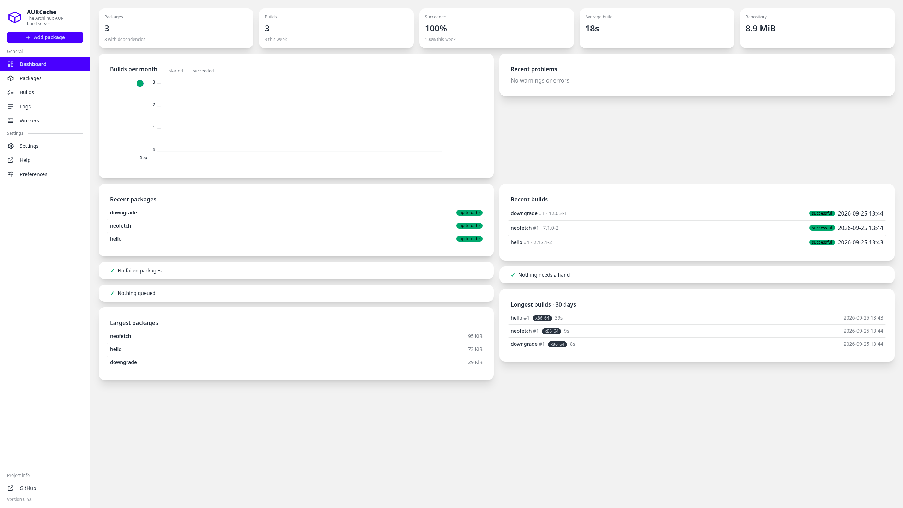
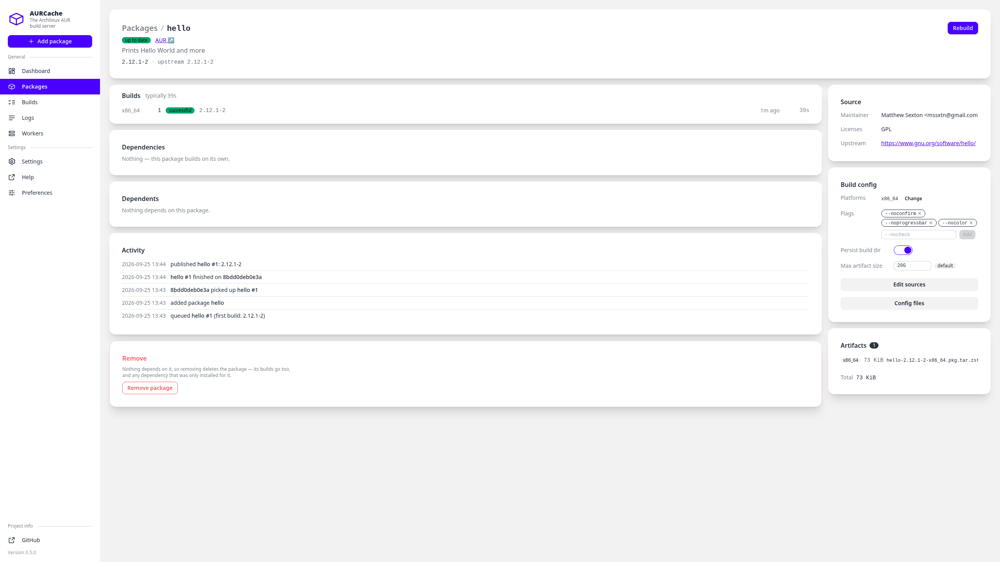
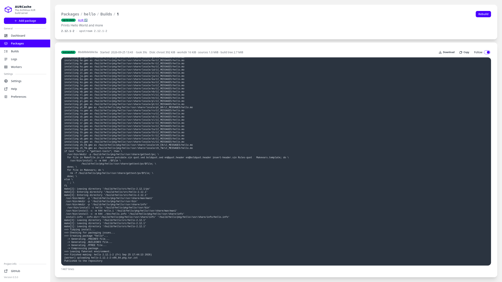

<p align="center">
    <a href="https://gyscos.github.io/AURCache/">
        </a><!-- </a> being on the same line as the  tag is intentional! -->
    <br>
    <br>
    <a href="https://github.com/gyscos/aurcache/releases">
        </a>
    <a href="https://github.com/gyscos/AURCache/pkgs/container/aurcache">
        </a>
    <a href="https://github.com/gyscos/AURCache/pkgs/container/aurcache">
        </a>
    <br>
</p>

<h4 align="center">
  <a href="https://gyscos.github.io/AURCache/docs/overview/introduction">Documentation</a> |
  <a href="https://gyscos.github.io/AURCache/">Website</a>
</h4>

# AURCache

AURCache is a build server and repository for Archlinux packages sourced from the AUR (Arch User Repository). It features a Rust frontend and backend, enabling users to add packages for building and subsequently serves them as a pacman repository. Notably, AURCache automatically detects when a package is out of date and displays it within the frontend.

<p> 

## Quickstart

Bring up the server plus a local build worker with a single command — no edits,
no secrets, no approval clicks:

```bash
curl -O https://raw.githubusercontent.com/gyscos/AURCache/main/compose/docker-compose.yaml
docker compose up -d
```

- Web UI / API: `http://localhost:8080` (plain HTTP; front with a reverse proxy for TLS)
- Pacman repo: `http://localhost:8081` (add as a `[repo] Server` in `pacman.conf`)

The bundled worker auto-enrolls via a shared volume and starts polling for jobs
within seconds. Scale local build throughput by raising the worker's concurrency
on its page in the web UI. To attach a worker on separate
hardware or a foreign architecture (e.g. aarch64), see
[`docker-compose.remote-worker.yaml`](compose/docker-compose.remote-worker.yaml).

Already running AURCache as a single container? It keeps working — the
`aurcache` image now bundles a build worker for exactly that case. It is
deprecated, so migrate to the split setup when convenient; see
[Backward compatibility](https://gyscos.github.io/AURCache/docs/setup/docker#backward-compatibility-the-hybrid-image).

## CLI client

Install it from the git repo:

```bash
cargo install --git https://github.com/gyscos/AURCache aurcache-cli
```

A typed CLI for the HTTP API (installed as `aurcli`). It authenticates with an API token via `Authorization: Bearer <token>`; generate one on the settings page of the web UI.
The reusable Rust client library backing it lives in `backend/aurcache-client`.
Configuration, tokens and `setup` are covered in [its README](backend/aurcache-cli/README.md).

```bash
export AURCACHE_URL=http://localhost:8080/api
export AURCACHE_TOKEN=your-token

aurcli pkg list
aurcli pkg add paru --platform x86_64
aurcli builds list --limit 10
aurcli token regenerate
```

The CLI also reads `~/.config/aurcache-client/config.json`.

Useful config commands:

```bash
aurcli config show
aurcli config set-url http://localhost:8080/api
aurcli config set-token
```

Use `--format json` for machine-readable output, or `raw` for endpoints that do not have a dedicated subcommand yet.

<details>
<summary>More Images:</summary>
<br>
 
</p>
</details>

## License

This project is licensed under the MIT License. Feel free to contribute and modify as per the guidelines outlined in the license agreement.
